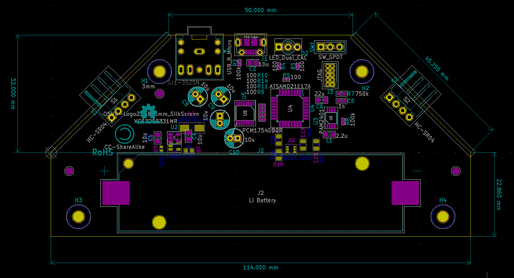

# USonic-Theremin
A portable, rechargeable theremin using ultrasonic transducers for distance sensing. Connect the device to any consumer-grade speaker or directly to your computer to record your sound!

Take a look at the <a href="Schematic_Capture.pdf">schematic<a/>
  
Feedback and derivatives are welcome! **NOTE** that the firmware files are licensed under a permissive MIT OSL, but the **hardware is licensed under a strongly reciprocal CERN-OHL-S license** which means all derivatives must undertake the same license.

Thanks,
Neil
